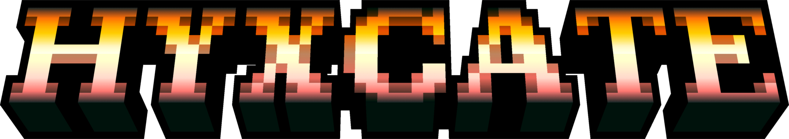
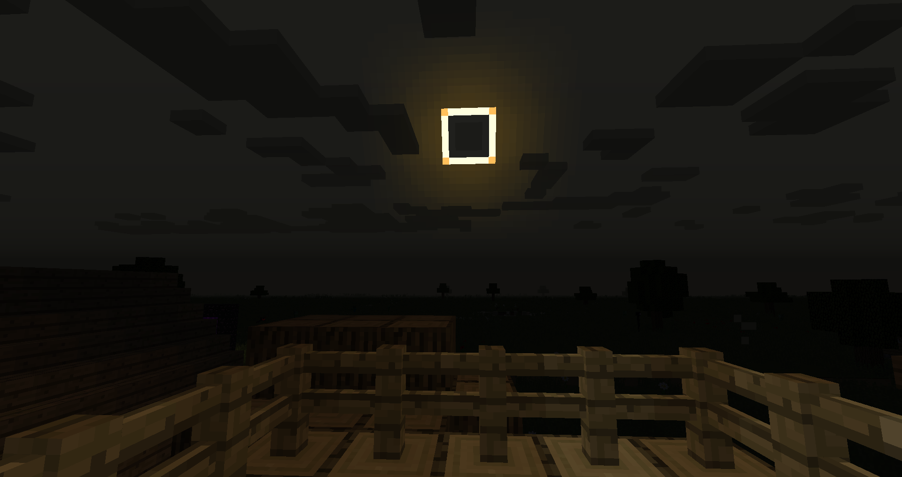
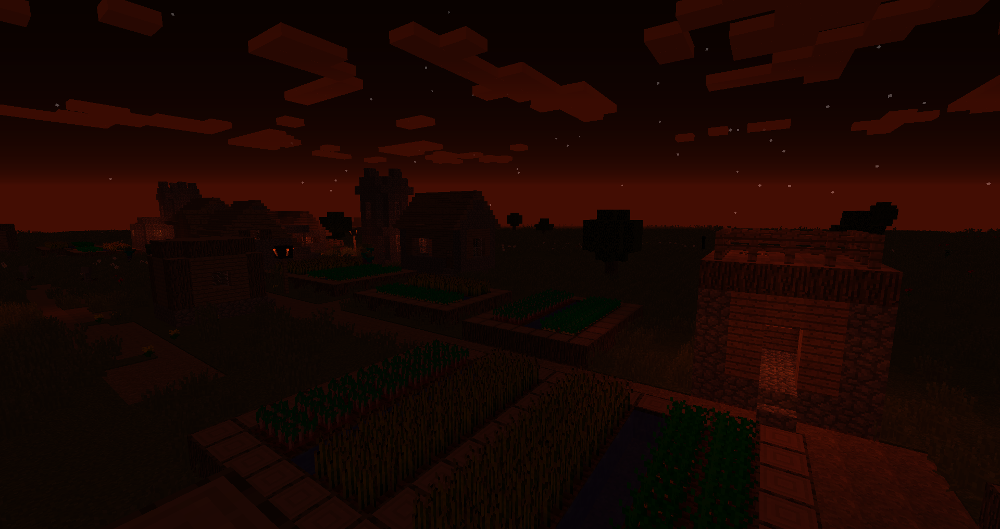
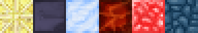

 

# Hyxcate

### Celestial Events, Meteors, and MORE!

**Hyxcate** (a portmanteau of the Greek goddess names Nyx and Hecate) is a grand sci-fi themed adventure mod that mainly introduces new events for day and night to make Survival even more challenging, as well as meteors containing special endgame materials. Originally it started off as a fork of **Nyx** for the **Hexxit II** modpack, it has now evolved into its own standalone mod with many features originating from Nyx being reworked or removed.

#### **_IMPORTANT: This mod is going to stay on 1.12.2, there are no plans for porting from our side! The mod is currently in Beta, things are subject to change and even be removed!_**

### 🔑 Key Features

- **Night Events:** Special events have a chance to trigger during the night. They can make your gameplay more difficult by spawning even more mobs per area and even more!
- **Day Events:** Not only are there night events, there are also events for the daytime. You might become unlucky with a sudden eclipse that acts like an extended night!
- **Falling Stars:** Stars fall during the night and can be caught, they can be used for building blocks and some recipes. In the future, there will be much more uses for these.
- **Falling Meteors:** Meteors of rare alien materials can fall towards your world, beware of the dangerous monsters they spawn! **Meteorite**, **Frezarite**, and **Kreknorite** meteors can be encountered, while **Tektite** gems can be found rarely when mining any hot meteor blocks or when slaying creatures originating from meteors. **Cyber Crystals** are also very rarely spawned by any meteor type.
- **Equipment:** New gear that exceeds diamonds?! **Meteorite**, **Frezarite**, **Kreknorite**, and **Tektite** are new tiers that are found exclusively in meteor crash sites, there are also special endgame weapons that utilize **Cyber Crystals**.
- **Enchantments:** Customize weapons and armor with **Lunar Edge** and **Lunar Shield**, the benefits of these enchantments are much more viable during the night!

### 📖 Quick Guide

#### 🌘 Night Events

- **Full Moon:** The full moon phase is now considered an event, but only when no other event is active. Hostile mobs will spawn more frequently and they can also sometimes spawn with positive status effects like **Strength** or **Resistance** to make them more difficult to fight. Untamed wolves will become hostile when approached, no werewolves on sight at least!
- **Blood Moon:** The moon and sky will turn a blood-red color. Hostile mobs will spawn much more frequently and you won't be able to sleep for the night.
- **Blue Moon:** The moon and sky will turn a deep blue color. This event is peaceful and prevents all hostile mobs from spawning. Additionally, crops will grow faster and you will be provided with the **Luck II** effect while the event remains active.
- **Star Shower:** The moon and sky will turn a bright yellow color. Falling stars will appear much more frequently while this event is active.

#### ☀️ Day Events

- **Grim Eclipse:** The sun gets blocked by an unknown planet-sized object. Hostile mobs will continue to spawn and not be able to burn under the sun as if it were an extended night. **NOTE:** It's not considered an actual eclipse and we're not exactly sure what the object blocking the sun is...
- **Red Giant:** The sun will temporarily exhaust its hydrogen fuel in its core, thankfully the world is resilient enough to handle the immense heat. Currently, this event is mostly cosmetic and still a work in progress!

#### 🐈 **Creatures**

- **Alien Creeper:** This very dangerous creeper variant that is found exclusively at meteor crash sites has over 80 health and is always charged. Does not like being around **Alien Kitties** and **Comet Kitties**.
- **Alien Kitty:** These cats are extraterrestrial and have 40 health! They are found exclusively at meteor crash sites and they tend to scare away **Alien Creepers**.
- **Comet Kitty:** Same as the **Alien Kitty** except they're a super intelligent cat species exploring the depths of space. Some of them have hitched a ride on a meteor by accident.

#### ☄️ Materials

**NOTE:** Meteorite tier and above have a mining level of 4!

- **Meteorite:** It is the most common metal found in meteors and requires a mining level of 3 to mine.
- **Frezarite/Kreknorite:** Both metals are uncommon from meteors and are of the same strength. They require a mining level of 4 to mine.
- **Tektite:** Gem clusters can be found rarely from mining any hot meteor rock or dropped from the unique meteor creatures.
- **Cyber Crystal:** These crystals are highly prized for their energy source contained, they are very rarely found on any meteor crash site. They require a mining level of 4 to mine.

#### 🗡️ Equipment

- **Meteorite:** Armor and weapons constructed out of **Meteorite** have the ability to pull in nearby items! The more equipment worn at once, the stronger the pull.
- **Frezarite:** Weapons constructed out of **Frezarite** have a strong AoE ability, all affected targets will also be inflicted with **Deep Freeze**. Armor constructed out of **Frezarite** will give infinite **Water Breathing** when the full set is worn while the boots will temporarily freeze water below the wearer.
- **Kreknorite:** Weapons constructed out of **Kreknorite** have a strong AoE ability. All affected targets will also be inflicted with **Inferno**. Armor constructed out of **Kreknorite** will give infinite **Fire Resistance** when the full set is worn.
- **Tektite:** Armor and weapons constructed out of **Tektite** have the ability to inflict **Paralysis**. This effect will disable the mob's AI and deal damage overtime while it is active.
- **Tektite Greatsword:** Tektite also includes a greatsword weapon. It has the same ability as its other tool counterparts except it has a much wider range.
- **Bow of Lightspeed:** This bow can fire arrows extremely fast and make them pack a punch!
- **Beam Swords:** These weapons are of pure plasma and energy, they will cut through even the strongest armor! They not only ignore armor, they will also ignore invincibility frames.
- **Celestial Warhammer:** This warhammer is of the stars! Hold right-click to hit the ground and fly up onto the air, then once you hit the ground, you'll deal a large AoE attack that will knock all your foes away and inflict them with the **Astral Erosion** effect.
- **Meteor Detector:** This high-tech device points you to the nearest meteor crash site. Right-clicking will give you the estimated amount of blocks left to reach the destination. Holding shift and right-clicking will give you the chance to delete the current location so that it can point towards another area instead.

#### 🧪 **Potion Effects**

- **Astral Erosion:** Inflicts damage over time (2 damage + 2 per level) and will damage faster per level. The affected user will glow and damage frames will also be completely ignored while it is active.
- **Deep Freeze:** Inflicts damage over time (1 damage + 1 per level) and will damage faster per level. It also provides a wide variety of debuffs: -25% **Jump Height** (-50% on Deep Freeze II and above), -25% **Speed** per level, -20% **Attack Speed** per level, and -20% **Mining Speed** per level.
- **Inferno:** Inflicts damage over time (1 damage + 1 per level) and will damage faster per level. Affected users that are fire resistant or have the **Fire Resistance** effect applied will have the damaged doubled instead of being immune to it.
- **Paralysis:** Inflicts damage over time (1 damage + 1 per level) and will damage faster per level. Completely disables AI on affected mobs while players will become completely immobile and are not able to use any tools. **Mining Speed** is also reduced by 100%.

#### 📚 **Attributes**

- **Explosion Resistance:** Exclusive to **Tektite** armor, it reduces damage against explosions similar to **Blast Protection**. The maximum **Explosion Resistance** is **+100%**.
- **Magnetization:** Exclusive to **Meteorite** armor and tools, nearby items will be drawn towards you. The higher the **Magnetization**, the higher the pull strength. The maximum **Magnetization** is **+10**.
- **Paralysis Chance:** Exclusive to **Tektite** tools, it will have a chance to inflict **Paralysis** on the hit target. The maximum **Paralysis Chance** is **+100%**.

#### 📖 **Enchantments**

- **Lunar Edge:** Adds bonus melee damage to the affected armor piece similar to **Sharpness**, the amount of bonus melee damage applied is increased during the night. Incompatible with **Bane of Arthropods**, **Sharpness**, and **Smite**. The max level is **V**.
- **Lunar Shield:** Adds bonus damage reduction to the affected armor piece similar to **Protection**, the amount of damage reduction applied is increased during the night. Incompatible with **Blast Protection**, **Fire Protection**, **Projectile Protection**, and **Protection**. The max level is **IV**.
- **Magnetization:** Enchantment counterpart of the attribute of the same name, when applied to any tool or armor, nearby items will be drawn towards you. Each level will increase the pull strength. Incompatible with **Meteorite** equipment. The max level is **V**.

### 🔁 **Mod Integration**

- With [**Astral Sorcery**](https://www.curseforge.com/minecraft/mc-mods/astral-sorcery) installed, Hyxcate events will never trigger on the same day the Horologium constellation (Solar Eclipse) happens.
- With [**CraftTweaker**](https://www.curseforge.com/minecraft/mc-mods/crafttweaker) installed, current lunar and solar events can be detected. See [this explanation page](https://github.com/Elite-Modding-Team/Hyxcate/wiki/CraftTweaker).
- With [**Demagnetize**](https://www.curseforge.com/minecraft/mc-mods/demagnetize) installed, Hyxcate magnetization effects will not pull items around activated Demagnetizers.
- With [**Future Fireproof**](https://www.curseforge.com/minecraft/mc-mods/future-fireproof) installed, many items and blocks added by Hyxcate will become immune to being destroyed by fire or lava, similar to Netherite from modern versions of Minecraft.
- With [**Tinkers' Antique (Tinkers' Construct)**](https://www.curseforge.com/minecraft/mc-mods/tinkers-antique) installed, there are new tool materials to tinker with. You can find more information on our [documentation here](https://github.com/Elite-Modding-Team/Hyxcate/wiki/Tinkers'-Construct)!
- With [**Antique Armory (Construct's Armory)**](https://www.curseforge.com/minecraft/mc-mods/antique-armory) installed, there are new armor materials to tinker with. You can find more information on our [documentation here](https://github.com/Elite-Modding-Team/Hyxcate/wiki/Tinkers'-Construct-(Construct's-Armory))!
- More to come!

### 👨‍💻 Main Developers, Collaborators, and Friends

- Lead Developer/Owner ~ IcarussOne
- Lead Developer ~ ACGaming
- Sound Artist ~ PessiMysterio
- Texture Artist ~ Ichipie1125
- Beam Sword textures, Alien Kitty textures, earlier weapon textures, and the space cat doodle on the bottom of this readme ~ Kimiko0402
- Extensive feedback on earlier versions of the mod ~ xJon

### 🙏 Special Thanks

- Originally creating [**Nyx**](https://www.curseforge.com/minecraft/mc-mods/nyx) (licensed under MIT) ~ Ellpeck
- Ideas from [**Falling Meteors**](https://www.curseforge.com/minecraft/mc-mods/falling-meteors-mod) ~ AlexDGr8r
- Cat texture from [**Xyn**](https://www.curseforge.com/minecraft/mc-mods/xyn-fork) ~ TheSlayer5934
- Creating the [**Hexxit edition of Red's Pack**](https://www.planetminecraft.com/texture-pack/reds-pack-hexxit-edition/), a few textures were used as a base for some parts of the mod ~ DeadDirtyRed
- [**Base texture for the Celestial Emblem**](https://github.com/malcolmriley/unused-textures) ~ MCThe_Paragon

### 🌐 Translators

- Chinese ~ star_rain
- German ~ ACGaming

Want to help translating? Submit a [**Pull Request**](https://github.com/Elite-Modding-Team/Hyxcate/pulls) or send your translation via [**Discord**](https://acgam.ing/discord)!

### 🔊 Sound Credits
- Horror sting by SamsterBirdies -- https://freesound.org/s/522567/ -- License: Creative Commons 0
- Organ Sting by nomiqbomi -- https://freesound.org/s/578805/ -- License: Creative Commons 0
- Victory (short sting) by xkeril -- https://freesound.org/s/706753/ -- License: Creative Commons 0
- StarsTwinklingB.wav by aj_heels -- https://freesound.org/s/520542/ -- License: Attribution 4.0
- Fire Breath.wav by bspiller5 -- https://freesound.org/s/157616/ -- License: Creative Commons 0
- Scary noise by SamsterBirdies -- https://freesound.org/s/555382/ -- License: Creative Commons 0
- Red Sun in the Sky - Note Block Cover by Jimmy145 -- https://youtu.be/PCERgEtiX7c

---

